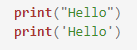
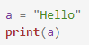
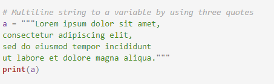
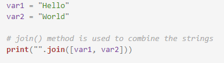
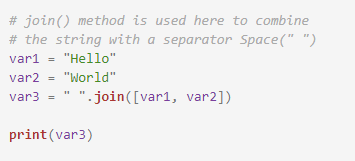
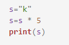
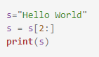
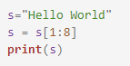
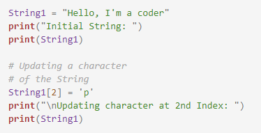

 <h3>String</h3>
                     We can access a string using indexing. In a string each character is assigned with a unique index value which starts from 0. A string can be written in both single quotes and double quotes.
Example  :  'Hello World' 
"Hello World"  
Program:  
  
Output:  
Hello 
Hello  
Program  
  
Output  
Hello  
Program  
  
Output  
Lorem ipsum dolor sit amet, 
consectetur adipiscing elit, 
sed do eiusmod tempor incididunt 
ut labore et dolore magna aliqua.  

Python allows negative indexing as well. 
Example : -1, -3, -5. 
Where -1 refers to the last index, -2 refers to second last index and so on. 
Printing here can be done by placing the string in single or double quotes after print. 
 
print("Hello World")  

<h4>Concatenation</h4>
A string in python is immutable i.e. it can not be changed once defined. But concatenation is still possible  
Program  
  
Output  
Hello WorldExample  
Using Join() method also we can concatenate string  
Program  
  
Output  
HelloWorld  
Program  
  
Output  
HelloWorld  
<h4>Repetition</h4>This is a unique property of strings in Python programming language. When a string is multiplied with an integer, the characters of string are multiplied the same number of times.  

Syntax : string * integer  

Program  
  
Solution  
kkkkk  
<h4>Slicing</h4>Slicing is done in Python to select or display the desired number of characters in a string. It is done with the help of symbol ':'  
Syntax : String[ index: ]  
Program  
  
Solution  
llo World  
All the characters from and after second index is selected  
Program  
  
Solution  
ello Wo  
Characters between index number 1 and 8 are selected  
Length of a string can be calculated using the len function.  
Syntax : len("string") 
len("Hello World" 
It will return 11.  
Deleting / updating from a String:  
In Python, Updation or deletion of characters from a String is not allowed. This will cause an error because item assignment or item deletion from a String is not supported  
Program  
  
Output  
Initial String: 
Hello, I'm a coder 
Traceback (most recent call last): 
  File "e:\VLAB\python\programs\a.py", line 51, in <module> 
    String1[2] = 'p' 
TypeError: 'str' object does not support item assignment
